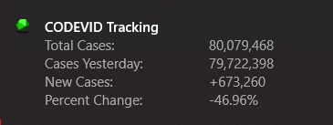

#  CODEVID

A simple web scraper for keeping track of COVID cases in the world.
All data comes from [worldometers](https://www.worldometers.info/coronavirus/).

## Usage

Run the program and it will send a desktop notification with the current number of cases, and the number of cases yesterday along with the current percent change in number of cases per day compared to 2 days ago to yesterday.

Below is a sample notification

-----

**DISCLAIMER**

This is my first web scraping project. It is very minimal in scope and not very useful.
The purpose of this project is simply for me to amass more experience with web scraping.